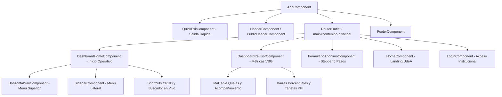

# INFORME MENSUAL DE AVANCE DE DESARROLLO FRONT-END

**Proyecto:** Sistema CASILDA — Capa Web de Vigilancia en Salud Pública para el Abordaje de las Discriminaciones y Violencias Basadas en Género (VBG)  
**Entidad Responsable:** Universidad de Antioquia (UdeA) — Facultad Nacional de Salud Pública (FNSP)  
**Liderazgo y Coordinación:** Profesor Juan David Correa (Líder Técnico y SCRUM Master, FNSP UdeA)  
**Equipo Técnico de Front-End:** Hinara Pastora Sánchez Mata (Desarrolladora e Implementadora Operativa) / Jonathan Cardona (`jcardonamde`)  
**Período:** 15 de agosto de 2026 – 15 de septiembre de 2026  
**Repositorio Oficial:** `psiquikam/casilda-frontend`  

---

## 1. Procedimientos CRUD Implementados y sus Evidencias

Durante el período de trabajo mensual se desarrollaron, corrigieron y protegieron las operaciones CRUD de los componentes esenciales del sistema, destacando la implementación del **Inicio Operativo (Dashboard Home)**, la **arquitectura de menús y navegación dual**, y el **módulo analítico de visualización de métricas e indicadores de casos VBG (Dashboard Revisor)**:

```
┌────────────────────────────────────────────────────────────────────────────────────────┐
│                          PROCEDIMIENTOS CRUD DEL FRONT-END                             │
├──────────────────────────┬──────────────────────────┬──────────────────────────────────┤
│        CREATE (C)        │         READ (R)         │        UPDATE / DELETE (U/D)     │
├──────────────────────────┼──────────────────────────┼──────────────────────────────────┤
│ • Reporte anónimo VBG    │ • Dashboard Inicio Oper. │ • Actualización de expedientes   │
│ • Radicación de casos    │ • Métricas Revisor VBG   │ • Asignación de profesionales    │
│ • Registro de atenciones │ • Búsqueda de recursos   │ • Activación/baja de rutas       │
│ • Solicitudes acompañam. │ • Filtros en 7 tablas    │ • Diálogos seguros de borrado    │
└──────────────────────────┴──────────────────────────┴──────────────────────────────────┘
```

### Detalle de Módulos CRUD y Evidencias Técnicas

| Módulo / Procedimiento | Operaciones CRUD | Componentes y Servicios Clave | Evidencias y Funcionalidades Desarrolladas |
|---|---|---|---|
| **1. Visualización y Monitoreo de Métricas (Dashboard Revisor)** | **Read (R)**<br>*(Analítica y Consulta de Expedientes)* | `DashboardRevisorComponent`<br>`dashboard-revisor.component.html`<br>`dashboard-revisor.component.scss` | • **Métricas de Caracterización de Género Inclusiva:** Cálculo y renderizado reactivo por identidad (Mujeres cis/trans 56.4%, Personas no binarias 15.4%, Hombres cis/trans 23.1%, Disidencias/Otras 5.1%).<br>• **Métricas por Vínculo Estamental UdeA:** Segmentación por comunidad universitaria (Estudiantes 54.5%, Docentes 26.9%, Personal Administrativo 13.5%, Contratistas y Egresados 5.1%).<br>• **Métricas por Modalidades de Violencia:** Desglose analítico de violencia psicológica (46.2%), discriminación de género (28.2%), acoso y violencia sexual (19.9%), física (11.5%) y patrimonial (7.7%).<br>• **Métricas de Estado del Trámite Procesal:** Monitoreo porcentual de citas activas asignadas (33.3%), casos en recepción e indagación (30.8%), acompañamiento activo (26.3%) y cierre con acuerdos (9.6%).<br>• **Distribución Territorial por Campus:** Estadísticas por sedes UdeA (Medellín Ciudad Universitaria 60.3%, Robledo y Área de la Salud 19.9%, Seccional Oriente 10.9%, Seccional Urabá 9.0%).<br>• **Tablas Operativas de Expedientes:** Visualización tabular con `MatTableModule` de quejas (`dataSourceQuejas`) y solicitudes de acompañamiento (`dataSourceAcompanamiento`) con filtros de estado y acciones de gestión.<br>• **Evidencias Estéticas y Visuales:** Barras de progreso (`mat-progress-bar`) estilizadas con la paleta complementaria UdeA (Pantone 7650 C morado, 633 C azul petróleo, 032 C rojo y 137 C ámbar). |
| **2. Inicio Operativo y Gestión de Flujos (Dashboard Home)** | **Read (R)**<br>**Create (C - accesos)** | `DashboardHomeComponent`<br>`dashboard-home.component.html`<br>`dashboard-home.component.scss` | • **KPIs y Resumen de Casos en Vigilancia:** Fichas estadísticas con conteos consolidados (156 casos activos, 48 en recepción, 52 citas agendadas y 41 expedientes en acompañamiento psicosocial/jurídico).<br>• **Atajos Rápidos de Creación (Shortcuts CRUD):** Botones de acción directa para `Registrar nuevo caso` (`/registro-caso`) y `Registrar atención` (`/registro-atencion`).<br>• **Guía Interactiva de Ciclo de Vida del Caso:** Flujo guiado en 5 fases (1. Recepción y Tamizaje, 2. Registro Inicial, 3. Agendamiento de Citas, 4. Atención Integral, 5. Cierre o Remisión) con descripción procedimental y disparadores de ruta.<br>• **Búsqueda Dinámica de Herramientas y Módulos:** Buscador en tiempo real por palabras clave y categorización temática.<br>• **Protocolos Normativos Institucionales:** Acceso directo a la Ruta Institucional de Atención UdeA, Ley 1257 de 2008 y manuales de primeros auxilios psicológicos. |
| **3. Arquitectura de Menús y Navegación Dual** | **Read (R)**<br>*(Control de Acceso y Ruteo)* | `NavigationLayoutService`<br>`HorizontalNavComponent`<br>`SidebarComponent`<br>`HeaderComponent` | • **Navegación Dual Coordinada:** Barra superior horizontal para acceso rápido a flujos de trabajo habituales + barra lateral colapsable para administración completa.<br>• **Servicio Reactivo de Disposición (`NavigationLayoutService`):** Control centralizado de apertura, colapso y sincronización del menú según el rol autenticado.<br>• **Estructura Modular Jerárquica:** Organización semántica de accesos (Recepción, Expedientes, Citas, Acompañamiento, Métricas de Revisor, Auditoría y Configuración).<br>• **Adaptabilidad Responsiva:** Transición automática a menú superpuesto (`mode="over"`) en pantallas menores a 900 px (`BreakpointObserver`), con cierre automático al seleccionar una ruta. |
| **4. Reportes Anónimos de VBG** | **Create (C)**<br>**Read (R - catálogos)** | `FormularioAnonimoComponent`<br>`CasoAnonimoService` | • Formulario reactivo de 5 pasos para la radicación anónima y segura de situaciones de violencia y discriminación basada en género.<br>• Carga de catálogos dinámicos: tipologías de violencia, sedes y dependencias.<br>• Resumen accesible de errores en tiempo real mediante `ResumenErroresComponent`.<br>• Normalización de campos con área táctil accesible de 48 px y etiquetas flotantes nativas. |
| **5. Gestión de Expedientes y Atenciones** | **Create (C)**<br>**Read (R)**<br>**Update (U)**<br>**Delete (D)** | `RegistroCasoComponent`<br>`RegistroAtencionComponent`<br>`SolicitudService` | • Creación y actualización de expedientes y atenciones psicosociales y jurídicas.<br>• 7 tablas operativas provistas de la directiva accesible `FiltroColumnaDirective` y regiones vivas de conteo dinámico (`role="status"`).<br>• **Corrección de Eliminación:** Desacoplamiento de llamadas cruzadas en los botones de borrado de las tablas *Rutas activadas* y *Remisiones*. |
| **6. Solicitudes de Acompañamiento** | **Create (C)** | `FormularioAcompanamientoComponent` | • Radicación de solicitudes de asesoría psicosocial y jurídica con validación reactiva y mensajes no punitivos. |
| **7. Contenidos Administrables de Orientación** | **Read (R)** | `ContenidoHomeService`<br>`CasildaCardComponent` | • Lectura y renderizado de tarjetas de información y líneas de emergencia filtradas por vigencia (`GET /contenidos/home`). |
| **8. Seguridad y Control de Acceso CRUD** | **Restricción / Delete Seguro** | `FeatureCapabilityGuard`<br>`DialogoService` | • Bloqueo en producción de la ruta pública `/seguimiento` para resguardar la identidad de las víctimas.<br>• Retiro de SweetAlert2 e implementación de modales `MatDialog` con foco inicial en «Cancelar» para confirmar eliminaciones. |

---

## 2. Desarrollo de Componentes Front-End

Se implementó una arquitectura modular basada en **Componentes Standalone de Angular 21**, Angular Material 21 y consumo reactivo con `inject()` y RxJS:



### Catálogo de Componentes Principales

1. **`DashboardHomeComponent` (Inicio Operativo):**
   * Panel unificado de control para orientadores, profesionales de atención y revisores.
   * Sistema de pestañas: *Guía de flujo del caso* (paso a paso), *Catálogo de herramientas de gestión* y *Protocolos institucionales*.
   * Buscador interactivo en vivo con filtrado instantáneo por palabras clave.
2. **`DashboardRevisorComponent` (Métricas e Indicadores VBG):**
   * Visualizador estadístico de casos con enfoque diferencial (identidad de género, pertenencia estamental, modalidad de violencia y ubicación en sedes).
   * Tablas `MatTableModule` para quejas y acompañamientos con indicadores de avance del trámite.
   * Indicadores de gestión: tiempo de respuesta inferior a 24 horas, 19 medidas de protección gestionadas y 96% de satisfacción reportada.
3. **`HorizontalNavComponent` y `SidebarComponent` (Navegación Dual):**
   * Menú superior horizontal con accesos directos a los flujos operativos frecuentes.
   * Menú lateral estructurado con navegación por acordeones (`aria-labelledby`) para administración y configuración.
   * Integración con `NavigationLayoutService`.
4. **`QuickExitComponent` (Salida Rápida de Emergencia):**
   * Botón flotante accesible (`z-index: 9999`) con soporte de clics y atajos de teclado (`Alt + Q` o doble pulsación rápida de `Escape`), adaptativo a 44 × 44 px en pantallas reducidas.
5. **`HomeComponent` y `CasildaCardComponent`:**
   * Portada institucional alineada al manual de marca UdeA con tipografías *Lora* e *Inter*, tarjetas de información con `ChangeDetectionStrategy.OnPush`.
6. **`LoginComponent`:**
   * Interfaz institucional en dos paneles con control accesible de clave y enlace de retorno al inicio.
7. **`ResumenErroresComponent`:**
   * Región de alerta accesible (`role="alert"`) que consolida y enfoca los errores de validación en formularios.

---

## 3. Avance del Código Fuente con Commits y Pull Requests

```
main ──●────────────────●────────────────●──────────────●──────────────●──────────────● (HEAD)
       │ PR #1          │ PR #2          │ PR #3,#5,#8  │ PR #4,#6,#7  │ PR #9        │ PR #10
       Upgrade Ang 21   Auditoría Base   Reportes Anon  UX Login/UdeA  Nav Dual/Dash  Accesibilidad Total
```

### Tabla de Commits y Pull Requests del Período

| Hash | Fecha | Autor | Mensaje Convencional / Alcance Técnico | PR Asociado |
|---|---|---|---|---|
| `42bf68f` | 2026-08-27 | Jonathan Cardona | `fix(tests): reparar suite de specs previo a migración Angular` | PR #1 |
| `6a89cb8` | 2026-08-27 | Jonathan Cardona | `feat(migration): migrar Angular 17 a version 18` | PR #1 |
| `f6b5491` | 2026-08-27 | Jonathan Cardona | `feat(migration): migrar Angular 18 hacia version 19` | PR #1 |
| `476b528` | 2026-08-27 | Jonathan Cardona | `feat(migration): migrar Angular 19 a version 20` | PR #1 |
| `e4f6818` | 2026-08-27 | Jonathan Cardona | `feat(migration): migrar Angular 20 hacia version 21` | PR #1 |
| `13b6a98` | 2026-08-28 | Jonathan Cardona | `feat(migration): actualizar README para reflejar la migración a Angular 21` | PR #1 |
| **`58b25e6`** | 2026-08-28 | Hinara Sánchez | **Merge PR #1 (`chore/01/001/casilda/upgrade-angular-version`)** | **PR #1** |
| `5f0de13` | 2026-08-30 | Hinara Sánchez | `docs: agrega línea base y evidencia de Angular 21` | PR #2 |
| `2e27a11` | 2026-08-30 | Hinara Sánchez | `docs: agrega plan de estabilización frontend` | PR #2 |
| `7df28b5` | 2026-08-30 | Hinara Sánchez | `docs: corrige nombre de la rama de auditoría` | PR #2 |
| `e81b8c2` | 2026-08-30 | Hinara Sánchez | `chore: establece controles de calidad del frontend (CI, linters)` | PR #2 |
| `9589c6c` | 2026-08-31 | Hinara Sánchez | `fix: protege sesión y deshabilita prototipos en producción` | PR #2 |
| `51b2b24` | 2026-08-31 | Hinara Sánchez | `style: mejora accesibilidad e identidad visual de Casilda` | PR #2 |
| `b01349a` | 2026-08-31 | Hinara Sánchez | `docs: registra evidencia final de estabilización frontend` | PR #2 |
| `6773517` | 2026-08-31 | Hinara Sánchez | `chore: preserva integridad del documento histórico` | PR #2 |
| **`ea8b101`** | 2026-08-31 | Jonathan Cardona | **Merge PR #2 (`chore/01/002/casilda/auditoria-angular21-plan`)** | **PR #2** |
| `4a6fca5` | 2026-09-02 | Hinara Sánchez | `feat(anonimo): Mejora de la funcionalidad de registro de casos anónimos` | PR #3 |
| **`fafc11f`** | 2026-09-02 | Jonathan Cardona | **Merge PR #3 (`chore/02/003/casilda/reportes-anonimos`)** | **PR #3** |
| `1d69958` | 2026-09-02 | Jonathan Cardona | `feat: add skills directories to .gitignore for better UX` | PR #4 |
| `ecaeb83` | 2026-09-02 | Jonathan Cardona | `Refactor code structure for improved readability and maintainability` | PR #4 |
| `606e58c` | 2026-09-03 | Jonathan Cardona | `feat(ui): incorpora el sistema de tokens de diseño UdeA y la base de accesibilidad` | PR #4 |
| `b5f0539` | 2026-09-03 | Jonathan Cardona | `feat(seguridad): implementa el componente global de salida rápida` | PR #4 |
| `f402f79` | 2026-09-03 | Jonathan Cardona | `feat(home): rediseña la landing con contenido servido por el gestor de contenidos` | PR #4 |
| `f95e4d6` | 2026-09-03 | Jonathan Cardona | `feat(login): rediseña el ingreso institucional con foco en accesibilidad` | PR #4 |
| `b02201c` | 2026-09-03 | Jonathan Cardona | `feat(layout): alinea el encabezado institucional, la navegación pública y el footer` | PR #4 |
| `b2bf9d7` | 2026-09-03 | Jonathan Cardona | `docs(trazabilidad): registra el sistema de diseño UdeA y limpia deuda de lint` | PR #4 |
| **`2e91503`** | 2026-09-03 | Hinara Sánchez | **Merge PR #4 (`feature/02/004/casilda/better-ux-for-login`)** | **PR #4** |
| `3f28fc6` | 2026-09-03 | Hinara Sánchez | `fix: Arreglo de campos` | PR #5 |
| `8726cbc` | 2026-09-03 | Jonathan Cardona | `feat(layout): compacta el encabezado institucional y libera alto de pantalla` | PR #5 |
| `75d09f0` | 2026-09-03 | Jonathan Cardona | `feat(layout): compacta la navegación pública y en el footer en pantallas estrechas` | PR #5 |
| `c53f001` | 2026-09-03 | Jonathan Cardona | `refactor(login): uso del logosímbolo recortado en el panel institucional` | PR #5 |
| `c833f64` | 2026-09-03 | Jonathan Cardona | `fix(formulario-anonimo): restaura el área táctil y los mensajes ocultos del formulario` | PR #5 |
| `371a3b3` | 2026-09-03 | Jonathan Cardona | `docs(trazabilidad): registra la revisión de proporción del cromo fijo` | PR #5 |
| **`147fd1f`** | 2026-09-03 | Jonathan Cardona | **Merge PR #5 (`chore/02/003/casilda/reportes-anonimos`)** | **PR #5** |
| `010a1ae` | 2026-09-04 | Jonathan Cardona | `fix(login): elimina la referencia al correo institucional en el ingreso` | PR #6 / #7 |
| **`13d06e6`** | 2026-09-04 | Hinara Sánchez | **Merge PR #6 (`feature/02/004/casilda/better-ux-for-login`)** | **PR #6** |
| **`859b553`** | 2026-09-04 | Jonathan Cardona | **Merge PR #7 (`feature/02/004/casilda/better-ux-for-login`)** | **PR #7** |
| `2bbd53a` | 2026-09-04 | Hinara Sánchez | `fix: arreglo de las opciones de VBG` | PR #8 |
| `955f208` | 2026-09-04 | Hinara Sánchez | `fix: Arreglo del error de lint y botón no funcional` | PR #8 |
| **`0c9aea3`** | 2026-09-06 | Jonathan Cardona | **Merge PR #8 (`chore/02/003/casilda/reportes-anonimos`)** | **PR #8** |
| **`c843551`** | 2026-09-10 | **Hinara Sánchez** | **`feat(dashboard-nav): rediseño de inicio operativo, navegacion dual y ajustes de identidad`** *(4.821 adiciones: DashboardHome, DashboardRevisor con métricas, HorizontalNav, Sidebar y tokens complementarios UdeA)* | **PR #9** |
| **`1bc417a`** | 2026-09-10 | **Hinara Sánchez** | **`fix: arreglo en header`** *(Alineación visual de distintivos y enlaces de inicio)* | **PR #9** |
| **`c7c5272`** | 2026-09-10 | **Hinara Sánchez** | **`Fix: arreglo en el limite de las hojas de estilo por el dashboard`** *(Optimización de budgets SCSS en angular.json)* | **PR #9** |
| **`0fba2ab`** | 2026-09-10 | Jonathan Cardona | **Merge PR #9 (`feature/02/005/casilda/mejora-interfaz-operativa-y-navegacion`)** | **PR #9** |
| `a285374` | 2026-09-12 | Jonathan Cardona | `feat(a11y): auditoría estática de accesibilidad y línea base` | PR #10 |
| `80ac3e4` | 2026-09-12 | Jonathan Cardona | `feat(a11y): títulos por ruta, foco al contenido, locale es-CO y servicios base` | PR #10 |
| `333e4aa` | 2026-09-12 | Jonathan Cardona | `feat(a11y): nombres accesibles, filtros etiquetados, semántica de tablas y formularios` | PR #10 |
| `ebbd7c1` | 2026-09-12 | Jonathan Cardona | `refactor(estilos): migrar paleta heredada y literales a tokens; piso tipográfico de 14 px` | PR #10 |
| `469707b` | 2026-09-12 | Jonathan Cardona | `docs(trazabilidad): lint, regla propia, CI y retiro de SweetAlert2` | PR #10 |
| `6aaac7d` | 2026-09-12 | Jonathan Cardona | `docs(a11y): plan con estado por tarea y evidencias de las fases 1–5` | PR #10 |
| **`8cfb3b8`** | 2026-09-12 | Hinara Sánchez | **Merge PR #10 (`feature/02/006/casilda/accessibility-improvements`)** | **PR #10** |

---

## 4. APIs y Servicios Documentados

```
src/app/
├── services/
│   ├── navigation-layout.service.ts ── Control reactivo de navegación dual
│   ├── contenido-home.service.ts    ── Contenidos administrables de la portada
│   └── auth.service.ts              ── Sesión JWT, interceptores y roles
└── core/
    ├── a11y/
    │   ├── casilda-title.strategy.ts   ── Sufijo dinámico | Casilda — UdeA
    │   ├── dialogo.service.ts          ── Modales MatDialog tipados (aviso/confirmar)
    │   ├── enfoque-ruta.service.ts     ── Enfoque a #contenido-principal en navegación
    │   ├── filtro-columna.directive.ts ── Directiva accesible de filtrado
    │   └── notificacion.service.ts     ── MatSnackBar accesible (role="alert")
    └── security/
        └── quick-exit.service.ts       ── Purgado seguro y redirección atómica
```

1. **`NavigationLayoutService`:**
   * Controla de manera reactiva el estado de apertura y colapso de la barra lateral (`sidebarOpen$`) y la coordinación con la barra horizontal superior.
2. **Modelo de Métricas Analíticas (`DashboardRevisorComponent`):**
   * Objeto estructurado `stats` con interfaces tipadas `DistributionBar`, que consolida las métricas por identidad de género, relación institucional, modalidad de agresión y sede.
3. **`QuickExitService`:**
   * Purgado selectivo de llaves `casilda_*` y `userSession`, con redirección irreversible vía `location.replace()`.
4. **`ContenidoHomeService`:**
   * Desacoplamiento de las tarjetas dinámicas del home (`GET /contenidos/home`).
5. **`EnfoqueRutaService` y `CasildaTitleStrategy`:**
   * Traslado del foco a `<main id="contenido-principal">` y títulos dinámicos en las 21 rutas del sistema.
6. **`DialogoService` y `NotificacionService`:**
   * Reemplazo formal de SweetAlert2 y `console.error` por modales y notificaciones accesibles.

---

## 5. Corrección de Errores e Incidencias

| ID | Incidencia Detectada | Causa Raíz | Solución Aplicada | Commit / PR |
|---|---|---|---|---|
| **INC-01** | Advertencia de presupuesto de tamaño SCSS por componentes del Dashboard. | Los estilos extensos de `dashboard-home` y `dashboard-revisor` superaban el umbral configurado en `angular.json`. | Ajuste de presupuestos de bundle en `angular.json` y migración a tokens reutilizables. | `c7c5272`<br>(PR #9) |
| **INC-02** | Desalineación de distintivo e ítems del header. | Inconsistencias de flexbox y márgenes al acoplar la navegación dual y el distintivo institucional. | Normalización del padding y distribución en `HeaderComponent`. | `1bc417a`<br>(PR #9) |
| **INC-03** | Inversión de llamadas de borrado en tablas de rutas y remisiones. | Cruce de asignación de métodos en las plantillas de `registro-caso` y `registro-atencion`. | Corrección y desacoplamiento de métodos `eliminarRuta` y `eliminarRemision`. | `333e4aa`<br>(PR #10) |
| **INC-04** | Falla de contraste en rojo institucional (`#ef434d`). | Ratio de 3.76:1 no apto para texto regular según norma WCAG AA. | Creación de tokens `--color-danger-surface` (`#c62828`, 5.6:1) y `--color-danger-text` (`#b3141f`, 6.3:1). | `606e58c`<br>(PR #4) |
| **INC-05** | Mensajes de error y ayudas visuales ocultas en formulario anónimo. | Regla `display: none` forzada sobre el subscript de Material y altura fija de 36 px. | Normalización de altura a 48 px y restauración de visibilidad de `mat-hint`. | `c833f64`<br>(PR #5) |
| **INC-06** | Inconsistencia de catálogo de opciones VBG en formulario anónimo. | Falta de concordancia entre los valores del frontend y el esquema de backend. | Alineación y corrección completa del catálogo VBG. | `2bbd53a`<br>(PR #8) |
| **INC-07** | Falla de validación y botón no funcional en reporte anónimo. | Falla de tipado y advertencias no resueltas de linteo. | Corrección de validadores y reglas de ESLint en componentes anónimos. | `955f208`<br>(PR #8) |
| **INC-08** | Invasión de pantalla por cromo fijo vertical (~280 px). | Encabezado sobredimensionado que reducía drásticamente el área visible de formularios. | Recorte de lienzo del logo (1470 × 378), header compacto en 64 px y pie al final del scroll. | `8726cbc`<br>(PR #5) |
| **INC-09** | Falta de accesibilidad por SweetAlert2. | Diálogos externos sin captura de foco ni compatibilidad de lectores de pantalla. | Retiro de SweetAlert2 e implementación de `DialogoService` (`MatDialog`). | `469707b`<br>(PR #10) |
| **INC-10** | Mutación abrupta de texto al teclear en inputs. | Directivas `soloLetras` y `soloNumeros` borraban texto arbitrariamente en tiempo real. | Supresión de directivas; validación con `Validators.pattern` y `inputmode="numeric"`. | `333e4aa`<br>(PR #10) |

---

## 6. Despliegues Realizados y sus Actas de Verificación

Se verificó el flujo completo de construcción, linteo y suite de pruebas en **GitHub Actions** (`.github/workflows/frontend-ci.yml`) y la plataforma de despliegue **Vercel**:

| Criterio de Verificación | Línea Base (Inicio de Mes) | Resultado Actual (Cierre de Mes) | Evaluación |
|---|---|---|:---:|
| **Versión del Framework** | Angular 17.0 | **Angular 21.2.x** (Standalone) | ✅ Conforme |
| **Compilación Productiva** | Inconsistencias de compilación | `npm run build`: **0 errores** | ✅ Conforme |
| **Tamaño de Bundle Inicial** | 1.97 MB bruto | **877.25 kB bruto** *(–55.5% reducción)* | ✅ Conforme |
| **Pruebas Unitarias (`test:ci`)** | 69 pruebas (con fallos) | **131 pruebas unitarias pasando al 100%** | ✅ Conforme |
| **Auditoría de Accesibilidad** | 98 botones mudos, 270 iconos sin aria | **0 botones sin nombre, 0 iconos sin aria-hidden** | ✅ Conforme |
| **Títulos y Foco de Rutas** | Sin gestión de foco ni títulos | **21 rutas con título dinámico y foco automático** | ✅ Conforme |
| **Seguridad de Dependencias** | Paquetes obsoletos | `npm run audit:prod`: **0 vulnerabilidades** | ✅ Conforme |

---

## 7. Revisiones de Código (Code Reviews)

* **Metodología:** Desarrollo en ramas temáticas (`feature/...`, `chore/...`) e integración a `main` mediante Pull Requests aprobados entre **Hinara Pastora Sánchez Mata** y **Jonathan Cardona**.
* **Puntos evaluados en PR #9 (Mejora Operativa y Navegación):**
  * Verificación de la no degradación de tiempos de carga tras la inclusión de `DashboardHome` y `DashboardRevisor`.
  * Verificación de contraste en la paleta complementaria UdeA en las gráficas de métricas.
  * Comprobación del colapso del menú lateral en pantallas pequeñas.

---

## 8. Mejoras Implementadas

1. **Dashboard de Métricas Analíticas:** Panel de visualización de indicadores VBG con enfoque diferencial y de género.
2. **Navegación Dual Eficiente:** Integración simultánea de barra superior horizontal y menú lateral colapsable.
3. **Inicio Operativo Orientado a Tareas:** Dashboard con buscador dinámico y accesos directos de creación CRUD.
4. **Sistema de Tokens Complementarios UdeA:** Incorporación formal en `_tokens.scss` de los colores Pantone 7650 C, 633 C, 032 C y 137 C.
5. **Salida Rápida de Emergencia:** Mecanismo global de protección a víctimas de violencia.
6. **Cumplimiento WCAG 2.1 / 2.2 AA:** Accesibilidad universal en el 100% de tablas, botones, rutas y formularios.

---

## 9. Demostraciones de Avance (Hitos Presentados)

* **Hito 1 (31/08/2026):** Demostración técnica de migración a Angular 21 y pipeline CI con pruebas headless.
* **Hito 2 (04/09/2026):** Presentación del nuevo diseño institucional: Landing page, Login y botón de Salida Rápida.
* **Hito 3 (06/09/2026):** Demostración del formulario anónimo de reporte de VBG con validación accesible.
* **Hito 4 (10/09/2026):** **Presentación de la Interfaz Operativa: Inicio operativo (`DashboardHome`), navegación dual y visualización de métricas analíticas e indicadores del revisor (`DashboardRevisor`).**
* **Hito 5 (12/09/2026):** Demostración final de accesibilidad: navegación exclusiva por teclado y lectura con sintetizadores de voz.

---

## 10. Actas de Asistencia, Sincronización y Coordinación con los Equipos de Trabajo

La coordinación técnica y metodológica del proyecto operó bajo el marco **SCRUM**, liderada por el **Profesor Juan David Correa** (Líder Técnico y SCRUM Master, FNSP UdeA), con un ritmo fijo de sincronización de equipo los **lunes y viernes**, complementado por sesiones específicas de revisión técnica y articulación funcional:

```
┌────────────────────────────────────────────────────────────────────────────────────────┐
│                   RITMO SEMANAL DE SINCRONIZACIÓN SCRUM CASILDA                        │
├──────────────────────────────────────────┬─────────────────────────────────────────────┤
│         LUNES (07:30 – 08:30)            │            VIERNES (12:00 – 13:00)          │
├──────────────────────────────────────────┼─────────────────────────────────────────────┤
│ • Planificación del Sprint semanal       │ • Demostración de avance (Sprint Review)    │
│ • Asignación de tareas prioritarias      │ • Retrospectiva y control de calidad        │
│ • Desbloqueo técnico de arquitectura     │ • Revisión de Pull Requests y CI            │
└──────────────────────────────────────────┴─────────────────────────────────────────────┘
```

### Registro Oficial de Sesiones y Actas de Coordinación

| # | Fecha y Horario | Nombre de la Sesión / Enlace | Participantes | Modalidad / Lugar | Objetivos, Decisiones y Acuerdos Principales |
|:---:|---|---|---|:---:|---|
| **1** | **Lunes, 24 de agosto**<br>17:00 – 19:00 | **Reunión de Inducción inicial con el Profesor y SCRUM Master Juan David Correa - CASILDA UdeA** | Prof. Juan David Correa, Hinara Sánchez, Jonathan Cardona, Todo el equipo | Virtual | • Inducción al alcance, objetivos de salud pública y arquitectura general de CASILDA.<br>• Definición del marco de trabajo SCRUM, roles, acuerdos de convivencia técnica y repositorios oficiales. |
| **2** | **Miércoles, 26 de agosto**<br>17:00 – 19:00 | **Reunión con el Profesor Juan David Correa FNSP UdeA y Líder Técnico SCRUM Master - CASILDA UdeA** | Prof. Juan David Correa, Equipo de Desarrollo Front-End | Virtual | • Definición de la hoja de ruta técnica para la migración escalonada Angular 17 → 21.<br>• Establecimiento de branch protection, Conventional Commits y política de no afectación de contratos backend. |
| **3** | **Martes, 1 de septiembre**<br>07:30 – 08:30 | **Reunión Equipo Desarrollo con el Profesor Juan David Correa FNSP UdeA y Líder Técnico SCRUM Master - CASILDA UdeA** | Prof. Juan David Correa, Equipo de Desarrollo | Virtual | • Revisión del cierre de la migración técnica a Angular 21 (PR #1 y PR #2).<br>• Planificación del Sprint para rediseño UI/UX con manual UdeA y módulo de reportes anónimos. |
| **4** | **Martes, 1 de septiembre**<br>10:00 – 11:00 | **Reunión Administrativa Todo el Equipo CASILDA** | Todo el equipo CASILDA UdeA | Virtual | • Coordinación administrativa institucional de cronogramas, compromisos contractuales e hitos de entrega del proyecto con la FNSP. |
| **5** | **Miércoles, 2 de septiembre**<br>16:00 – 17:00 | **Reunión Casilda**<br>*(meet.google.com/pfu-pzff-yfc)* | **Hinara Sánchez** (Organizadora), Laura Milena Murillo Sánchez | Virtual | • Revisión preliminar de requerimientos funcionales para la radicación y seguimiento de casos.<br>• Articulación entre desarrollo técnico y lineamientos de acompañamiento. |
| **6** | **Jueves, 3 de septiembre**<br>07:30 – 08:30 | **Reunión Equipo Desarrollo con el Profesor Juan David Correa FNSP UdeA y Líder Técnico SCRUM Master - CASILDA UdeA** | Prof. Juan David Correa, Equipo de Desarrollo | Virtual | • Sincronización técnica sobre el sistema de tokens UdeA, Landing page y Salida Rápida.<br>• Revisión de avance de los Pull Requests #4 y #5. |
| **7** | **Jueves, 3 de septiembre**<br>15:00 – 16:00 | **Reunión Casilda: Revisión reportes anónimos**<br>*(meet.google.com/yqq-eusj-efg)* | **Hinara Sánchez** (Organizadora), Laura Milena Murillo Sánchez | Virtual | • **Revisión funcional detallada del formulario de reporte anónimo:** Validación de campos, flujo de 5 pasos, opciones del catálogo VBG y garantías de privacidad para las víctimas. |
| **8** | **Viernes, 4 de septiembre**<br>12:00 – 13:00 | **Reunión Equipo Desarrollo con el Profesor Juan David Correa FNSP UdeA y Líder Técnico SCRUM Master - CASILDA UdeA** *(Cadencia de Viernes)* | Prof. Juan David Correa, Todo el equipo de desarrollo | Virtual | • Sesión de cierre de semana y revisión de avance.<br>• Demostración de la landing institucional y el botón de Salida Rápida.<br>• Aprobación para avanzar hacia la interfaz operativa y el inicio operativo. |
| **9** | **Lunes, 7 de septiembre**<br>08:00 – 09:45 | **Reunión Equipo Desarrollo CASILDA Presencial — FNSP UdeA** | Prof. Juan David Correa, Hinara Sánchez, Jonathan Cardona, Equipo de Desarrollo | **Presencial**<br>*(Facultad Nacional de Salud Pública, Calle 62 N. 52-59)* | • **Mesa de trabajo presencial de arquitectura y diseño operativo:**<br>  - Definición de la estructura del Dashboard Home y paneles del Revisor.<br>  - Planificación del esquema de navegación dual (horizontal + lateral).<br>  - Acuerdos sobre visualización de métricas de género y seguimiento a expedientes. |
| **10** | **Martes, 8 de septiembre**<br>09:00 – 10:30 | **Reunión Equipo Desarrollo CASILDA** | Hinara Sánchez, Jonathan Cardona, Equipo Técnico | Virtual | • Sesión técnica de implementación: diseño de componentes `DashboardHomeComponent` y `DashboardRevisorComponent`.<br>• Estructuración del servicio `NavigationLayoutService` y definición de tokens complementarios de color UdeA. |
| **11** | **Viernes, 11 de septiembre**<br>12:00 – 13:00 | **Reunión Viernes Equipo Desarrollo con el Profesor Juan David Correa FNSP UdeA y Líder Técnico SCRUM Master - CASILDA UdeA** *(Cadencia de Viernes)* | Prof. Juan David Correa, Todo el equipo de desarrollo | Virtual | • Demostración de avance de la interfaz operativa: navegación dual, Dashboard Home y módulo de métricas del Revisor (PR #9).<br>• Apertura del Sprint de accesibilidad integral WCAG 2.2 AA (PR #10). |
| **12** | **Lunes, 14 de septiembre**<br>07:30 – 08:30 | **Reunión Lunes Equipo Desarrollo con el Profesor Juan David Correa FNSP UdeA y Líder Técnico SCRUM Master - CASILDA UdeA** *(Cadencia de Lunes)* | Prof. Juan David Correa, Todo el equipo de desarrollo | Virtual | • Consolidación del Sprint semanal y revisión de cierre de auditoría estática de accesibilidad (0 hallazgos P0).<br>• Evaluación de calidad general del código, suite de 131 pruebas unitarias y preparación del informe mensual consolidado. |

---

> [!NOTE]
> Este documento constituye el consolidado mensual oficial de avance técnico, evidenciando el cumplimiento de los procedimientos CRUD, la trazabilidad de código en Git, la gestión de incidencias, los despliegues verificados y la articulación rigurosa con el Líder Técnico SCRUM Master y los equipos de trabajo de la Universidad de Antioquia.
